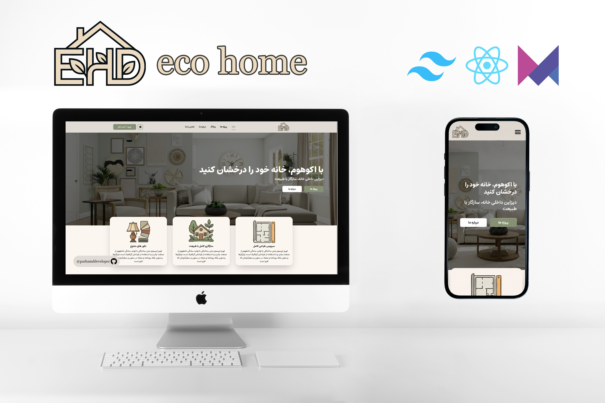
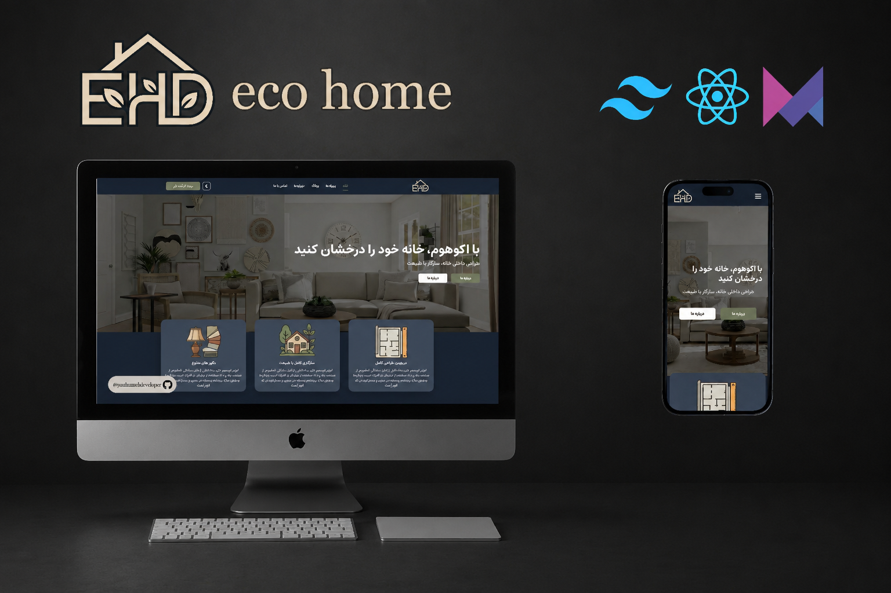

# 🏡 EcoHome - Interior Design & Architecture Platform

A modern, responsive, and high-performance web application for interior design and architectural projects built with **React**, **Tailwind CSS**, and **Framer Motion**.

---





---

## 💻 Live Demo
🔗 **[View Live Project](https://ecohome-react.vercel.app/)**

---

## ⚡ Performance Highlights
Optimized for exceptional speed, UX, and accessibility using modern frontend practices:
- 💯 **100% Performance Score** on Google Lighthouse (Desktop)
- 🎨 Smooth **60fps Animations** with Framer Motion
- 🌓 Seamless **Dark / Light Mode** switching
- 📱 Fully Responsive & Mobile-First Layout


---

## 🛠️ Tech Stack & Tools


---

## ✨ App Features

- **Dynamic Off-Canvas Navigation:** Smooth sliding menu with scroll-lock prevention on exit animations.
- **Sticky Header System:** Second Header shows when you scroll down.
- **Project Showcase:** Filterable gallery displaying design and architecture projects.
- **Theme Switcher:** Smooth dark/light mode toggle.


---


## ⬇️How To install?
If you want to install this app and run it locally, Make sure you have Node.js installed on your machine and follow these steps:
### 1. Clone the repository
```
git clone https://github.com/Parhamddeveloper/ecohome.git
```
### 2. Navigate to the project directory
```
cd ecohome
```
### 3. Install dependencies
```
npm install
```
### 4. Run the App
```
npm run dev
```
you can open the app using this address:

**http://localhost:5173/**

**Note :If you want to build the App, after installing dependencies, follow these steps :**
### 1. Build the App
```
npm run build
```
### 2. Run the App  
```
npm run preview
```
**Another note: if you build the app and you want preview it, you must open the app using this address:**

**http://localhost:4173**

## Credits
This app made and designed by [Parham Daneshnejad](https://github.com/parhamddeveloper/) with love❤️❤️